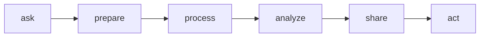
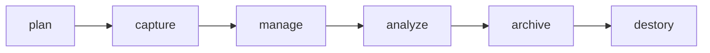

# Foundation: Data Data Everywhere

## Week1

### Transforming data into insights
The 6 steps for `data analysis process` explained in this program is and the courses are structured to do this,

> One of the many things that makes data analytics so exciting is that the problems are always different, the solutions need creativity, and the impact on others can be great.

[Conjecture vs Theory](https://www.quora.com/In-science-what-is-the-difference-between-conjecture-hypothesis-and-theory)

### Understanding the data eco-system

It's important to go against the **gut feeling** since it will introduce bias.

$$
\begin{equation*}
\mathrm{data} + \mathrm{business\quad knowledge} = \mathrm{mystery 
\quad solved}
\end{equation*}
$$

不管是去哪个领域，domain-specific knowledge都是非常重要的，因为这都是解决问题的一部分，对于很多领域的知识，一部分是业内才知道的轻重缓急和行业痛点和核心难点，另一部分是统计的基础和知识，但data以及how to get data to the right people efficiently是非常重要的.

Let's get back to google's data analytics process or mindset:
- `Ask`: Business challenge/objective/question
- `Prepare`: Data generation, collection, storage and data management
- `Process`: Data cleaning/data integrity
- `Analyze`: Data exploration, visualization and analysis
- `Share`: Communicating and interpreting results.
- `Act`: Putting ur insights to work to solve the problem.

那我在SHPT的工作也可以说是完成了一个`data analysis life cycle`了, 真心希望接下去的部分能顺利进行下去.

Key questions help analysts test whether they have accomplished enough to move forward and ensure that teams have spent enough time on each of the phases and `don’t start modeling before the data is ready`. It is a little different from the data analysis life cycle this program is based on, but it has some core ideas in common: the first phase is interested in discovering and asking questions; 

很多时候企业运行的太快，目标太急太赶，都没办法停下来思考.

除了google的这数据分析的`data analysis life cycle`，其它公司和人都提出了类似的开发循环和周期,但大同小异.

两本参考的书籍:

[EMC dell](https://onlinelibrary.wiley.com/doi/book/10.1002/9781119183686)

[Big Data Adoption](https://www.informit.com/articles/article.aspx?p=2473128&seqNum=11&ranMID=24808)

## Week2

### Embracing your data analyst skills

Five essential aspects of analytical skills,

- Curiosity 
- Understand context 
- A techanical mindset
  - Break down an action into smaller steps.
- Data design
  - How you organize information.
- Data strategy
  - Management of the people, processes and tools used in data analysis.

Although you are using those tools extensively in your daily life, you still need to fill in the necessary and specific skills for the job.

### Thinking about analytical thinking

> Thinking is 2nd nature to us, but we rarely think about thinking.

`Analytical thinking` has 5 elemments:
- **visualization**: graphical visualization is better than
- **strategy**:
- **problem-oriented**: 
- **correlation**: Rainy season correlates with umberla sales boost. But remember, correlation doesn't mean causation.
- **big picture yet detail oriented**:

> `Root cause`: the reason why a problem occurs. a common solution to find root cause is to ask yourself why 5 times.

> `Gap analysis`: a method for examining and evaulating how a process works currently to get to where you want to be in the future.

### Using data to drive successful outcomes

`Data-driven decision-making`: using facts to guide business strategy.

这个例子很有意思`google human resource`通过一系列措施来判断扁平化管理和有manager哪个更好.

Quartile: split data points into four equal quartile.

## Week 3

### Data life cycle

The `data lifecycle` is shown in the flowchart below,

### Outlining the data analysis process

This google data program is based upon the data analysis process discussed in week 1.

> Stakeholders: People who have invested time and resources into a project and are interested in the outcome.

After determining who the stakeholders' are, you need to ask questions to know their expectation. How to ask effective question to the stakeholder to know what they want is very important and often neglected. You need to find what they really want.

#### Molly:Example of the data process

Molly is really passionate about data and there are two take-aways:
- Data cleansing is important since it's the time for you to learn the nuance of this paticular data which help you get insight later on during the analysis phase.
- Don't skip steps. You would miss tons of information.

#### Structuring ur data
Simplest way to structure your data is by putting it in a table, for a table,
- A table consists of rows and columns
- Each row is a different observation
- Each column is a different attribute of that observation

For time series data stored in a structured table, it reminds me of eulerian view in fluid dynamics

In eulerian view analogy, You, as the stationary observer, is standing there and the data just flow through you. You simply observe them.

### The data analyst tools

#### Spreadsheets

Spreadsheets:
- Microsoft Excel
- Google Sheet

#### Databases and query languages

> Database: a collection of structured data stored in a computer system.

#### Visualizaion tools
Data visualization:
- `Tableau` drag-and-drop feature lets users create interactive graphs in dashboards and worksheets.
- `Looker` communicates directly with a database, allowing you to connect your data right to the visual tool you choose.

#### Self-reflection

> Quesion1: What is the relationship between the data life cycle and the data analysis process? How are the two processes similar? How are they different?

While the data analysis process will drive your projects and help you reach your business goals, you must understand the life cycle of your data in order to use that process. To analyze your data well, you need to have a thorough understanding of it. Similarly, you can collect all the data you want, but the data is only useful to you if you have a plan for analyzing it.

> Quesion2: What is the relationship between the Ask phase of the data analysis process and the Plan phase of the data life cycle? How are they similar? How are they different?

Great work reinforcing your learning with a thoughtful self-reflection! A good reflection on this topic would consider the phases that data goes through in its life cycle and how this impacts the data analysis process.

While the data analysis process will drive your projects and help you reach your business goals, you must understand the life cycle of your data in order to use that process. To analyze your data well, you need to have a thorough understanding of it. Similarly, you can collect all the data you want, but the data is only useful to you if you have a plan for analyzing it.

The Plan and Ask phases both involve planning and asking questions, but they tackle different subjects. The Ask phase in the data analysis process focuses on big-picture strategic thinking about business goals. However, the Plan phase focuses on the fundamentals of the project, such as what data you have access to, what data you need, and where you’re going to get it.

## Week 4
---
### Mastering spreadsheet basics

> attributes: (also called column name)

> Observation: all of the attributes for somethng contained in a row of a data table.

## References
- [google sheets](https://support.google.com/a/users/answer/9282959?visit_id=637361702049227170-1815413770&rd=1)
- [google-spreadsheet](https://support.google.com/a/users/answer/9300022)

### SQL basics

>query: request for data or information from database

- [SQL basics](https://www.w3schools.com/sql/default.asp)
- [SQL Cheat sheet](https://towardsdatascience.com/sql-cheat-sheet-776f8e3189fa)

### Data visualization

The best way for me is by determinging whether the data is for `categorical` or `numerical`. If you label the available data by catogory, you could use different graphs types for each combination. This is how you could pick your arsenal.

## Week5
---
In this week, the outline is shown as following,
- the role of a data analyst
- business task for DA
- fairness in analysis (avoiding bias)

### DA job opportunities

gives some information about where your skills would be applicable.

### The importance of fair business decision

Observation, intuition are powerful tools in decision-making, but they can only take us so far. When we make decisions based on just observation and gut feelings, we are only seeing part of the picture. **Data helps us see the whole picture**.

> How to make sure your data is fair? `Fairness` means ensuring that your analysis does not create or reinforce bias.

Sometimes, your data could be true but unfair.

How could data help other people have a better life? Data are people and it has temperature.

> `oversampling`: an under-represented group of passengers should be oversampled.

Google HR who specifically hiring analytics suggests:
- professional networling by:
  - increase online footprint by updating linkIn and github where lots of your projects are there
  - coffee chat and meet-up with other DS professionalist.
- they sense whether you would be a good-fit for the team.

### Extra reading

[Anna Leach DA journey](https://www.youtube.com/watch?v=t2oOFs4WgI0)

---
## Course Wrap-up
In this very first course, the key takeaway are:
- The major steps in data analysis
- The data life cycle
- toolboxs required
- fairness when u analyze to avoid bias as much as possible