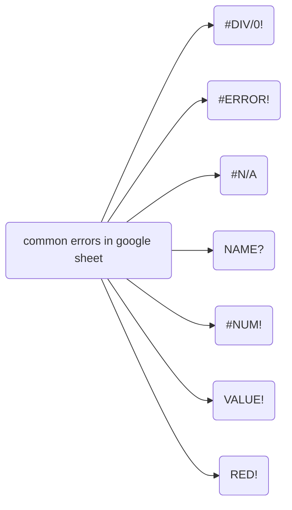
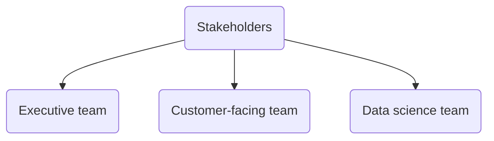

# Foundation: Ask questions to make data-driven decision

Outline:
- how to ask effective questions to stakeholders
- how to tell a meaningful story about the data
- why and how to be on the same page as your stakeholders

## Week1
---
In week 1, you are going to learn:
- How to ask effecitve questions during the ask phase of data analysis process with one of the structured thinking framework `SMART`.
- real-life examples and case study on `SMART` framework. 

### Problem-solving and effective questioning
Brief introduction to this course. Course instructor looks nice.

### Take action with data

Case study: help anywhere gaming repair to post ads for getting new customers
- finds out people ages from 18 to 35 are more likely to own a gaming console and make gaming-related purchases. They are target customers.
- finds out target customer's interest the most
  - Tv-commerical 
  - podcast
- On a limited budget and TV-commerical are expensive, then podcast
- take you to value town

> Take action with data - reading provides a good framework for structured thinking.

### Solve problems with data
Common problem types that you are going to encounter in DA job:
- Making predictions
  - **Definition**:Usind data the predict how things would be in the future.
  - **Tools**:
- Categorizing things
  - **Definitions**: assigning information to different groups or clusters based on common features.
  - **Tools**:
- Spotting something unusual
  - **Definition**: identifying that is different from the norm.
  - **Tools**:
- Identifying themes
  - **Definition**: grouping categorized information into broader concept.
  - **Tools**:
- Discovering connections
  - **Definition**: Finding similar challenges faced by different entities and combining data and insights to address them. 
- Finding patterns
  - **Definition**: Using historical data to understand what happened in the past and is therefore likely to happen again 
  - Example: Studying customer buying behabior by e-commerce 

Get familiar with the common types that DA are facing. It will play a valuable role in developing product sense.

### Craft effective questions

SMART method:
- `Specific`
  - Specific quesions are simple, significant, and focused on a single topic or a few closely related ideas.
  - Examples:
    - bad one: Are kids getting enough exercise these days?
    - good one: What percentage of kids achieve the recommended 60 mins of physical activity at least five days a week? 
- `Measureable`
  - Measurable questions can be quantified and assessed?
  - Examples:
    - bad one: why did our recent video go viral?
    - good one: How many times was our video shared on social channels the first week it was posted?
- `Acition-oriented`
  - action-oriented encourage changes
  - Examples:
    - bad one: How can we get customers to recycle our product packaging?
    - good one: What design features will make our packaging easier to recycle?
- `Relevant`
  - Relevant questions matter, are important, and have significance to the problem you are trying to solve.
  - Examples:
    - bad one: Why does it matter that Pine Barrens tree frogs started disappearing?
    - good one: What environmental factors changed in Durham, North Carolina, between 1983 and 2004 that could cause Pine Barrens tree frogs to disappear from the Sandhills Regions?
- `Time-bound`
  - limit the range of the data. 
  - Examples:
    - bad one: see example in relevant.
    - good one: see example in relevant.

Also fairness,
- `Fairness`
  - Ensuring your question doesn't reinforce bias.
  - Examples:
    - Bad one: what do you love about our company?
    - Bias: you are assuing employee loves the company and it is also suggesting an answer as part of the question. It will cause employee go along with it and say something nice about the company.

## Week2
---
In week 2, you are going to learn
- Difference between quantitive data and qualitive data
- What's common metrics in other industry?
  - ROI
  - Customer retention rate
- Data visualization by report and dashboard
  - types of dashboard

### Understand the power of data

> what's data-insprired and data-driven decision-making?

- data-insprired decision-making:
  - explore different data sources to find commonalities.

Some example (data trials and triumphs)

#### Coke launch failure
Data-driven decision based on incomplete data.

#### Mars orbiter loss
NASA lost 125 million Mars Climate Orbiter in 1999 because nav software used metric system while engineers build space craft with imperical system (pounds). 

#### Crate and Barrel
using data help digital transformation during pandemic.

> Qualitative and quantitative data

- `quantitative`: specific and objective measures of facts
  - what?
  - how many?
  - how often?

- `qualitative`:subjective or explanatory measures of qualities and characteristics or things can't be measured.
  - why?

### Follow the evidence

> Reports vs Dashboards

Reports:
- Pros:
  - high-level historical data
  - easy to design
  - pre-cleaned and sorted data
- Cons:
  - Continual maintanence

Dashboards
- Pros:
  - Dynamic, automatic, and interactive
  - More stakeholder access
  - Low maintenance
- Cons:
  - Labor-intensive design
  - can be confusing
  - potentially uncleaded data

Pivot table: a data summarization tool that is used in data processing. Pivot tables are used to **summarize, sort, reorganize, group, count, total or average** data stored in a database.

- `Metric`: single, quantifiable type of data that can be used for measurement.
- Examples:
  - ROI (return of investment):
  - customer intention rate: 

Types of dashboards:
- `Strategic`: focuses on long term goals and strategies at the highest level of metrics
- `Operational`: short-term performance tracking and intermediate goals
- `Analytical`: consists of the datasets and the mathmatics used in these sets

### Connecting the data dots

Some metrics: 
- `Bed Occupancy Rate`: Total # inpatient days for a given period X 100/ (available beds X # of days in the period).

## Week 3
---

### Working with spreadsheets

[google sheet shortcuts](https://support.google.com/docs/answer/181110#zippy=%2Cmac-shortcuts)

### Formulas in spreadsheets

Some common errors encounters in google sheet

### Functions in spreadsheets
Some basic spreadsheets skills.
- freeze is useful tho
- filter view is useful
- functions (preset command) and formula are useful

### Save time with structured thinking

> `Structured thinking`: the process of recognizing the current problem or situtaion, organizing available information, revealing gaps and opportunities, and identifying the options.

It is often used to save resources such as time.

> `Problem domain`: the specific area of analysis that encompasses every activity affecting or affected by the problem

`Scope of Work (SOW)` 
- deliverables
- timelines
- milestones
- reports

There’s no standard format for an SOW. They may differ significantly from one organization to another, or from project to project. However, they all have a few foundational pieces of content in common. 

- **Deliverables**: What work is being done, and what things are being created as a result of this project? When the project is complete, what are you expected to deliver to the stakeholders? Be specific here. Will you collect data for this project? How much, or for how long?   
Avoid vague statements. For example, “fixing traffic problems” doesn’t specify the scope. This could mean anything from filling in a few potholes to building a new overpass. Be specific! Use numbers and aim for hard, measurable goals and objectives. For example: “Identify top 10 issues with traffic patterns within the city limits, and identify the top 3 solutions that are most cost-effective for reducing traffic congestion.”

- **Milestones**: This is closely related to your timeline. What are the major milestones for progress in your project? How do you know when a given part of the project is considered complete? 
Milestones can be identified by you, by stakeholders, or by other team members such as the Project Manager. Smaller examples might include incremental steps in a larger project like “Collect and process 50% of required data (100 survey responses)”, but may also be larger examples like ”complete initial data analysis report” or “deliver completed dashboard visualizations and analysis reports to stakeholders”. 

- **Timeline**: Your timeline will be closely tied to the milestones you create for your project. The timeline is a way of mapping expectations for how long each step of the process should take. The timeline should be specific enough to help all involved decide if a project is on schedule. When will the deliverables be completed? How long do you expect the project will take to complete? If all goes as planned, how long do you expect each component of the project will take? When can we expect to reach each milestone?
- **Reports**: Good SOWs also set boundaries for how and when you’ll give status updates to stakeholders. How will you communicate progress with stakeholders and sponsors, and how often? Will progress be reported weekly? Monthly? When milestones are completed? What information will status reports contain?
At a minimum, any SOW should answer all the relevant questions in the above areas. Note that these areas may differ depending on the project. But at their core, the SOW document should always serve the same purpose by containing information that is specific, relevant, and accurate. If something changes in the project, your SOW should reflect those changes.

**Staying objective** is key to avoid bias and it happens more often than you think. 
- Conclusion can be influenced by your own conscious and subconscious biases.
- Remain objective and recognize all sides of an argument.

Typically, you want to aks 5W (who, what, when, where and why) in order to put info into context.

## Week 4
---
### Balance team and stakeholder needs

The key is to work with stakeholders and find out what they need since they invest resources into the project. A diagram for stakeholders are shown in the figure below

### Communication is Key

Before you communicate, think about
- Who your audience is
- What they already know
- What they need to know
- How can you communicate that effectivelly to them

Balancing expectations and realistic projects goals.

> Sometimes you are just gonna accpet the fact that you can't find all information you want in the data.

> When ecountered with stakeholders who set up way higher expectations, you just need to reoutline the milesstones to a more realistic one.

### Amazing teamwork

Conflict is usually a result of:
- Mismatched expectations and miscommunications

