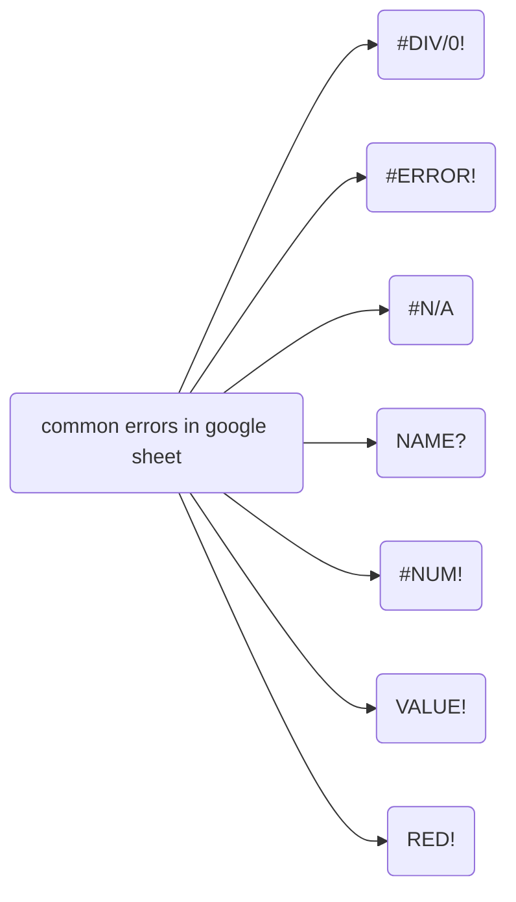

# Foundation: Ask questions to make data-driven decision

Outline:
- how to ask effective questions to stakeholders
- how to tell a meaningful story about the data
- why and how to be on the same page as your stakeholders

## Week1
---
In week 1, you are going to learn:
- How to ask effecitve questions during the ask phase of data analysis process with one of the structured thinking framework `SMART`.
- real-life examples and case study on `SMART` framework. 

### Problem-solving and effective questioning
Brief introduction to this course. Course instructor looks nice.

### Take action with data

Case study: help anywhere gaming repair to post ads for getting new customers
- finds out people ages from 18 to 35 are more likely to own a gaming console and make gaming-related purchases. They are target customers.
- finds out target customer's interest the most
  - Tv-commerical 
  - podcast
- On a limited budget and TV-commerical are expensive, then podcast
- take you to value town

> Take action with data - reading provides a good framework for structured thinking.

### Solve problems with data
Common problem types that you are going to encounter in DA job:
- Making predictions
  - **Definition**:Usind data the predict how things would be in the future.
  - **Tools**:
- Categorizing things
  - **Definitions**: assigning information to different groups or clusters based on common features.
  - **Tools**:
- Spotting something unusual
  - **Definition**: identifying that is different from the norm.
  - **Tools**:
- Identifying themes
  - **Definition**: grouping categorized information into broader concept.
  - **Tools**:
- Discovering connections
  - **Definition**: Finding similar challenges faced by different entities and combining data and insights to address them. 
- Finding patterns
  - **Definition**: Using historical data to understand what happened in the past and is therefore likely to happen again 
  - Example: Studying customer buying behabior by e-commerce 

Get familiar with the common types that DA are facing. It will play a valuable role in developing product sense.

### Craft effective questions

SMART method:
- `Specific`
  - Specific quesions are simple, significant, and focused on a single topic or a few closely related ideas.
  - Examples:
    - bad one: Are kids getting enough exercise these days?
    - good one: What percentage of kids achieve the recommended 60 mins of physical activity at least five days a week? 
- `Measureable`
  - Measurable questions can be quantified and assessed?
  - Examples:
    - bad one: why did our recent video go viral?
    - good one: How many times was our video shared on social channels the first week it was posted?
- `Acition-oriented`
  - action-oriented encourage changes
  - Examples:
    - bad one: How can we get customers to recycle our product packaging?
    - good one: What design features will make our packaging easier to recycle?
- `Relevant`
  - Relevant questions matter, are important, and have significance to the problem you are trying to solve.
  - Examples:
    - bad one: Why does it matter that Pine Barrens tree frogs started disappearing?
    - good one: What environmental factors changed in Durham, North Carolina, between 1983 and 2004 that could cause Pine Barrens tree frogs to disappear from the Sandhills Regions?
- `Time-bound`
  - limit the range of the data. 
  - Examples:
    - bad one: see example in relevant.
    - good one: see example in relevant.

Also fairness,
- `Fairness`
  - Ensuring your question doesn't reinforce bias.
  - Examples:
    - Bad one: what do you love about our company?
    - Bias: you are assuing employee loves the company and it is also suggesting an answer as part of the question. It will cause employee go along with it and say something nice about the company.

## Week2
---
In week 2, you are going to learn
- Difference between quantitive data and qualitive data
- What's common metrics in other industry?
  - ROI
  - Customer retention rate
- Data visualization by report and dashboard
  - types of dashboard

### Understand the power of data

> what's data-insprired and data-driven decision-making?

- data-insprired decision-making:
  - explore different data sources to find commonalities.

Some example (data trials and triumphs)

#### Coke launch failure
Data-driven decision based on incomplete data.

#### Mars orbiter loss
NASA lost 125 million Mars Climate Orbiter in 1999 because nav software used metric system while engineers build space craft with imperical system (pounds). 

#### Crate and Barrel
using data help digital transformation during pandemic.

> Qualitative and quantitative data

- `quantitative`: specific and objective measures of facts
  - what?
  - how many?
  - how often?

- `qualitative`:subjective or explanatory measures of qualities and characteristics or things can't be measured.
  - why?

### Follow the evidence

> Reports vs Dashboards

Reports:
- Pros:
  - high-level historical data
  - easy to design
  - pre-cleaned and sorted data
- Cons:
  - Continual maintanence

Dashboards
- Pros:
  - Dynamic, automatic, and interactive
  - More stakeholder access
  - Low maintenance
- Cons:
  - Labor-intensive design
  - can be confusing
  - potentially uncleaded data

Pivot table: a data summarization tool that is used in data processing. Pivot tables are used to **summarize, sort, reorganize, group, count, total or average** data stored in a database.

- `Metric`: single, quantifiable type of data that can be used for measurement.
- Examples:
  - ROI (return of investment):
  - customer intention rate: 

Types of dashboards:
- `Strategic`: focuses on long term goals and strategies at the highest level of metrics
- `Operational`: short-term performance tracking and intermediate goals
- `Analytical`: consists of the datasets and the mathmatics used in these sets

### Connecting the data dots

Some metrics: 
- `Bed Occupancy Rate`: Total # inpatient days for a given period X 100/ (available beds X # of days in the period).

## Week 3
---

### Working with spreadsheets

[google sheet shortcuts](https://support.google.com/docs/answer/181110#zippy=%2Cmac-shortcuts)

### Formulas in spreadsheets

Some common errors encounters in google sheet

### Functions in spreadsheets
Some basic spreadsheets skills.
- freeze is useful tho
- filter view is useful
- functions (preset command) and formula are useful

### Save time with structured thinking

