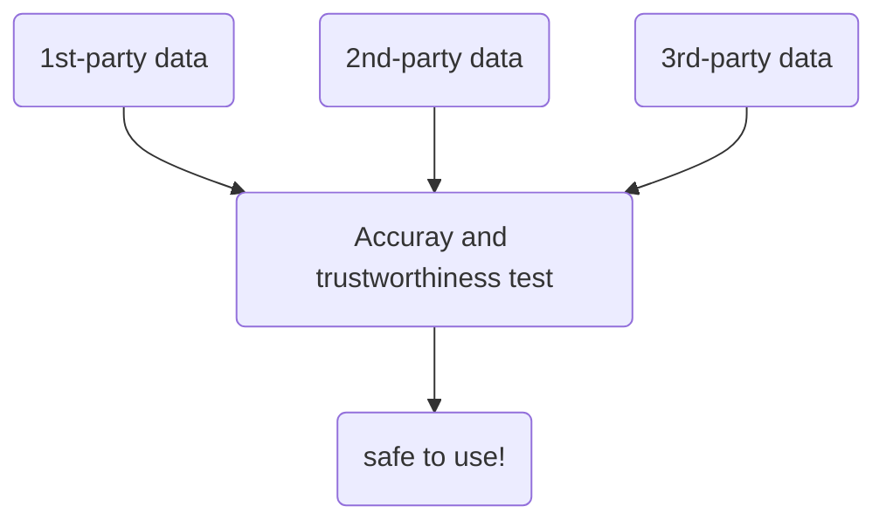

# Prepare Data for Exploration

Outline:
- a
- b
- c

## Week 1
---

### Data exploration
basic intro

### Collecting data

Data sources:
- `first-party data`: data collected by an individual or group using their own resources
- `2nd-party data`: data collected by a group directly from its audience and then sold (still reliable came from experienced group).  
- `3rd-party data`: is sold by a provider that didn't collect the data themselves.

1st-party data is more reliable but it takes time to collect if project timeline is tight. 2nd-party data is a good alternative since it's collected by people in the field so its reliable, not like 3-rd party data. 

### Differentiate between data formats and structures

What is data modelling?

Data modeling is the process of creating diagrams that visually represent how data is organized and structured.  These visual representations are called data models. You can think of data modeling as a blueprint of a house. At any point, there might be electricians, carpenters, and plumbers using that blueprint. Each one of these builders has a different relationship to the blueprint, but they all need it to understand the overall structure of the house. Data models are similar; different users might have different data needs, but the data model gives them an understanding of the structure as a whole. 

Data models such as **Entity Relationship Diagram (ERD)** and **Unified Modeling Language (UML)** diagram. This part is really important for understanding how data is stored in the organization.

#### Reference
https://dataedo.com/blog/basic-data-modeling-techniques

### Explore data types, fields, and values

long data vs wide data.

## Week 2
---
### Unbiased anb objective data

> `Bias`: a preference in favor of or against a person or a group of ppl.

> `Data bias`: a type of error that systematically skews results in a certain direction

Types of data bias:
- `Sampling bias`: a sample is not representative of the entire population
- `Observer bias`: also called experimenter bias or research bias. It is defined as the tendency for different people to observe things differently
- `Interpretation bias`: the tendency to always interpret ambiguous situations in a positive or negative way (different background or past experience)
- `Confirmation bias`: the tendency to search for or interpret information in a way that confirms pre-existing beliefs (You see wut you want to see).

### Explore data credibility 

Process for identifying good data **ROCCC** :
- reliable
- original
- comprehensive
- Current (out-of-date)
- Cited

 ### Data ethics and privacy

 > `Ethics`: Well-founded standards for right and wrong that prescribe what humans ought to do, usually in terms of rights, obligations, benefirs to society, fairness, or specific virtues.

 > `Data ethics`: Well-founded standards of right and wrong that dictate how data is collected, shared and used.

 > `Ownership`: individuals own the raw data they provide and they have primary control over its usage, how its processed and how its shared.

 > `Transcation transparency`: all data-processing activities and algorithms should be completely explainable and understood by the individual who provides their data.

 > `Currency`: individuals should be aware of financial transcations resulting from the use of their personal data and the scale of these transcations.

 > `Openness`: Free access, usage and sharing of data.

 > `Data anonymization`: removing personally identifiable information in AI.

### Understanding open data

Recall **openness**.

> `Data interoperability`: the ability of data systems and services to openly connect and share data.

Some useful resources:
1. [U.S. goverment data site.](https://data.gov)
2. [U.S. Census Bureau.](https://www.census.gov/data.html)
3. [Open Data Network](https://www.opendatanetwork.com)
4. [Google Cloud Public Datasets](https://cloud.google.com/datasets)
5. [Dataset Search](https://datasetsearch.research.google.com)