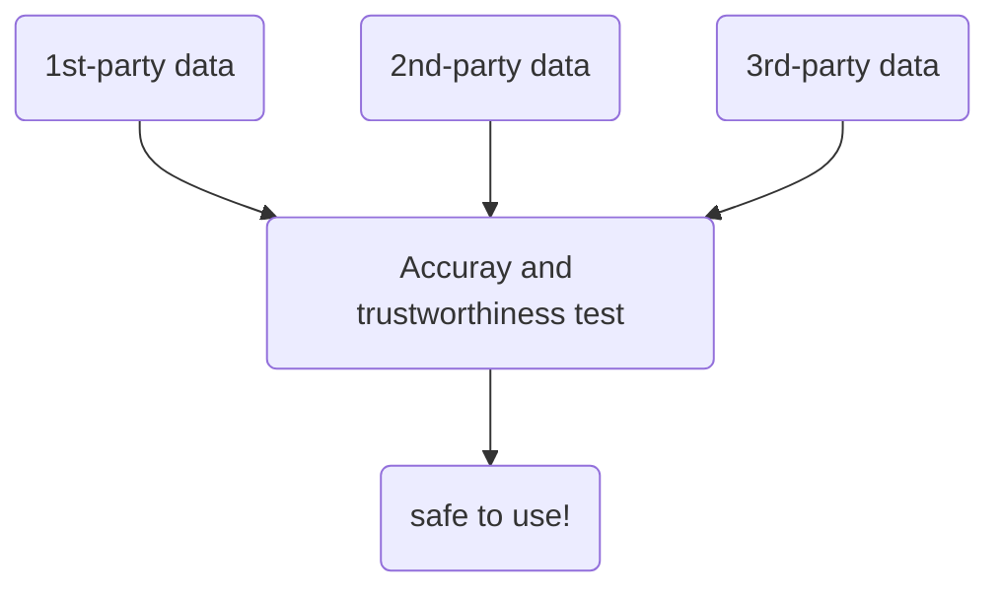

# Prepare Data for Exploration

Outline:
- a
- b
- c

## Week 1
---

### Data exploration
basic intro

### Collecting data

Data sources:
- `first-party data`: data collected by an individual or group using their own resources
- `2nd-party data`: data collected by a group directly from its audience and then sold (still reliable came from experienced group).  
- `3rd-party data`: is sold by a provider that didn't collect the data themselves.

1st-party data is more reliable but it takes time to collect if project timeline is tight. 2nd-party data is a good alternative since it's collected by people in the field so its reliable, not like 3-rd party data. 

### Differentiate between data formats and structures

What is data modelling?

Data modeling is the process of creating diagrams that visually represent how data is organized and structured.  These visual representations are called data models. You can think of data modeling as a blueprint of a house. At any point, there might be electricians, carpenters, and plumbers using that blueprint. Each one of these builders has a different relationship to the blueprint, but they all need it to understand the overall structure of the house. Data models are similar; different users might have different data needs, but the data model gives them an understanding of the structure as a whole. 

Data models such as **Entity Relationship Diagram (ERD)** and **Unified Modeling Language (UML)** diagram. This part is really important for understanding how data is stored in the organization.

#### Reference
https://dataedo.com/blog/basic-data-modeling-techniques

### Explore data types, fields, and values
